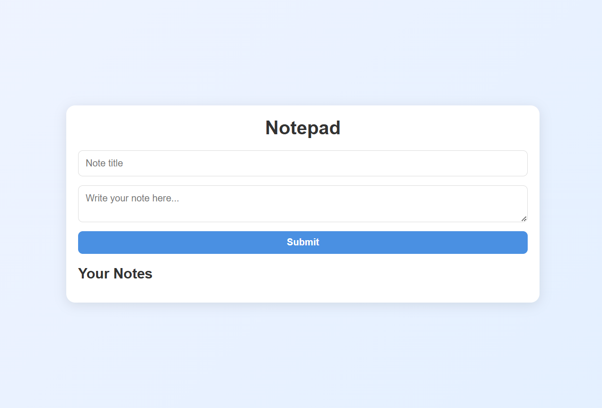
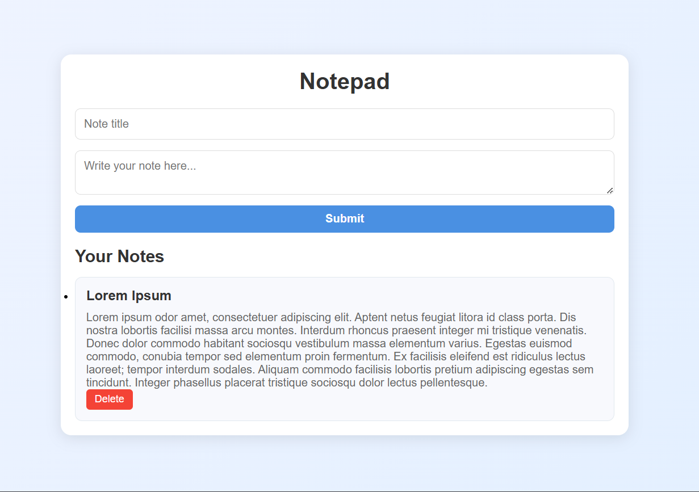

# Modern Notepad Project

This project is a simple notepad application built using **Node.js**, **Express**, **MongoDB**, **EJS**, and **CSS**. It allows users to add, delete, and view notes, with all notes stored permanently in the database.

## Table of Contents
- [ScreenShots](#screenshots)
- [Features](#features)
- [Built With](#built-with)
- [Prerequisites](#prerequisites)
- [Installation and Usage](#installation-and-usage)
- [Environment Variables](#environment-variables)
- [Contact](#contact)

## ScreenShots




<p align="right">(<a href="#table-of-contents">back to top</a>)</p>

## Features

- **Add New Note**: Easily add new notes to the database.
- **Delete Notes**: Remove stored notes from the database.
- **Clean and Modern Design**: Simple, optimized user interface.
- **Persistent Storage**: Notes are stored permanently in a database.

<p align="right">(<a href="#table-of-contents">back to top</a>)</p>

## Built With

This project was built with the following technologies:

* 
* 
* 
* 
* 

<p align="right">(<a href="#table-of-contents">back to top</a>)</p>

## Prerequisites

Before starting, please make sure you have installed:

- **Node.js** (version 14.x or higher)
- **npm** (Node Package Manager)
- **MongoDB** for note storage

<p align="right">(<a href="#table-of-contents">back to top</a>)</p>

## Installation and Usage

### Step 1: Clone the repository
```bash
git clone https://github.com/AmirrezaAhmadi/Notepad-With-NodeJs.git
cd Notepad With NodeJs
```
### Step 2: Install dependencies
```bash
npm install
```
### Step 3: Set up environment variables

1. Rename the .env.example file to .env in the root directory:
```bash
mv .env.example .env
```

2. Open the .env file and add the required values, such as the database connection string:

```bash
MONGO_URI=your_mongodb_connection_string
PORT=3000
```

### Step 4: Run the app

```bash
npm start
```
### Step 5: Access the app
Open your browser and go to http://localhost:3000 to access the Notepad app and start using its features.

<p align="right">(<a href="#table-of-contents">back to top</a>)</p>

## Environment Variables

To run this project, set up a .env file in the root directory with the following content:
```bash
MONGO_URI=your_mongodb_connection_string
PORT=3000
```
You can get your MongoDB connection string from MongoDB.

<p align="right">(<a href="#table-of-contents">back to top</a>)</p>

## Contact

You can reach me through the following:

* Email: AmirrezaAhmadi.GH@Gmail.com
* Telegram: https://t.me/AmirrezaDevelop
* Instagram: https://www.instagram.com/codewithamirreza
* Project Link: https://github.com/AmirrezaAhmadi/Notepad-With-NodeJs.git

<p align="right">(<a href="#table-of-contents">back to top</a>)</p>